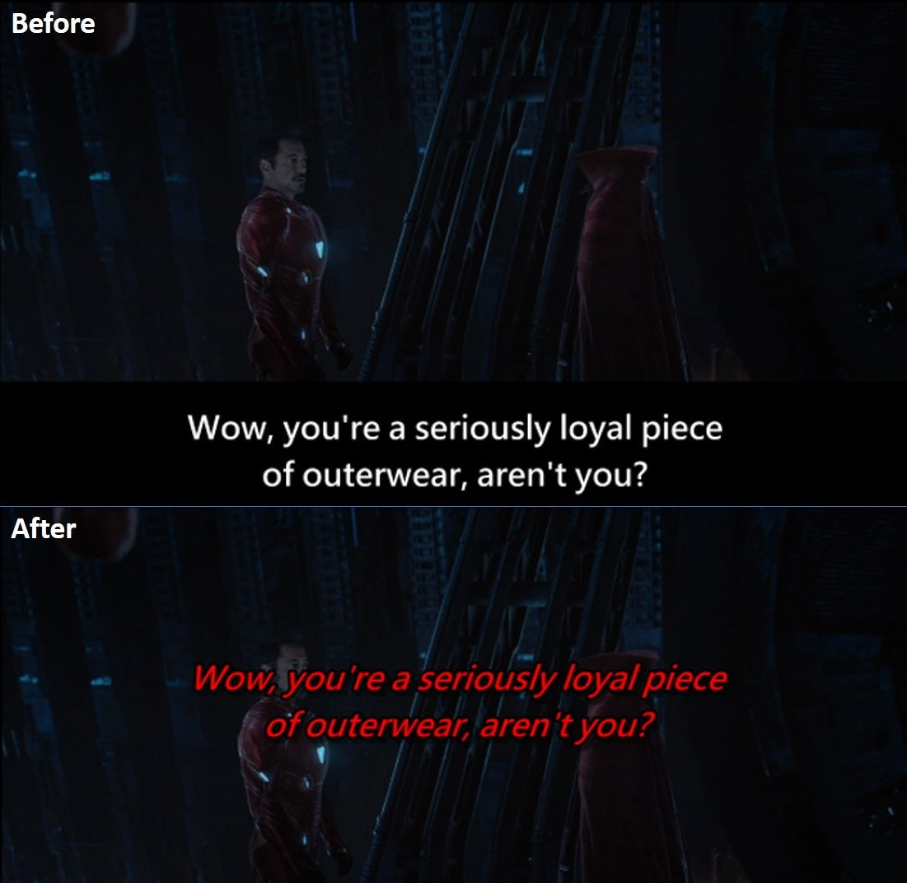

# **Introduction to SRTtools**


`SRTtools` is a R package that can simply adjst subtitles time, style and position for srt file.

***

## **Package Setup**

```r
library(SRTtools)
```

***

## **Examples**


### **Read srt file**

```r
srt <- srt.read('Avengers3.srt')
> srt
   [1] "1"                                                   "00:00:25,525 --> 00:00:29,904"                      
   [3] "<i>This is the Asgardian"                            "refugee vessel </i>Statesman<i>.</i>"               
   [5] ""                                                    "2"                                                  
   [7] "00:00:32,657 --> 00:00:36,119"                       "<i>We are under assault."                           
```

### **Postpone subtitles 0.5 seconds later**

```r
srt_later <- srt.shift(srt, time_shifted = 0.5)
> srt_later
   [1] "1"                                                   "00:00:26,025 --> 00:00:30,404"                      
   [3] "<i>This is the Asgardian"                            "refugee vessel </i>Statesman<i>.</i>"               
   [5] ""                                                    "2"                                                  
   [7] "00:00:33,157 --> 00:00:36,618"                       "<i>We are under assault."                           

```

### **Expedite subtitles 0.5 seconds earlier**

```r
srt_earlier <- srt.shift(srt, time_shifted = -0.5)
> srt_earlier
   [1] "1"                                                   "00:00:25,025 --> 00:00:29,404"                      
   [3] "<i>This is the Asgardian"                            "refugee vessel </i>Statesman<i>.</i>"               
   [5] ""                                                    "2"                                                  
   [7] "00:00:32,157 --> 00:00:35,618"                       "<i>We are under assault."                           
```
### **Save as 'Avengers3_new.srt' file**
```r
srt.write(srt_earlier, filename = "Avengers3_new.srt")
```
### **Retrieve subtitle content only**
```r
> srt.content(srt)
   [1] "<i>This is the Asgardian"                            "refugee vessel </i>Statesman<i>.</i>"               
   [3] "<i>We are under assault."                            "I repeat, we are under assault.</i>"                
   [5] "<i>The engines are dead, life support failing.</i>"  "<i>Requesting aid from any vessel within range.</i>"
   [7] "<i>We are 22 jump points out of Asgard.</i>"         "<i>Our crew is made up of Asgardian families."  

```
### **Change color and position of subtitles which contains 'Wow'**
```r
> srt.style(srt, line = srt.search(srt,"Wow"), pos = 'middle-center', style = c('b','i'), col = 'red')
 [418] "791"                                                                              
 [419] "01:00:28,545 --> 01:00:29,379"                                                    
 [420] "the stone."                                                                       
 [421] ""                                                                                 
 [422] "792"                                                                              
 [423] "01:00:41,975 --> 01:00:44,394"                                                    
 [424] "{\\an5}<b><i><font color='red'>Wow, you're a seriously loyal piece</b></i></font>"
 [425] "{\\an5}<b><i><font color='red'>of outerwear, aren't you?</b></i></font>"          
 [426] ""                                                                                 
 [427] "793"                                                                              
 [428] "01:00:44,561 --> 01:00:46,563"                                                    
 [429] "Yeah, speaking of loyalty..."    
```
<p align="center">
  
</p>

***

## **Developers**

#### **Dependencies**

It is highly recommended that you use the [RStudio IDE](https://www.rstudio.com/products/RStudio/) to develop this package. In addition to an [R installation](https://cran.r-project.org/bin/windows/base/), you'll also need to [install Rtools](https://cran.r-project.org/bin/windows/Rtools/) and a TeX distribution. [TeX Live](https://tug.org/texlive/) is a comprehensive distribution that seems to work well.

Once you have cloned this repository, you'll need to download the build package dependencies. These dependencies are managed with `packrat` and can be restored by running

```r
if (!require(packrat)) install.packages("packrat")
packrat::on()
packrat::restore()
```

***

## **Documentation**

The `roxygen2` R package is used to manage `SRTtools`'s documentation. Do not edit any of the files that have a warning comment at the top about manually editing those files!

You can regenerate package documentation with the RStudio shortcut Ctrl+Shift+Enter, or by running

```r
roxygen2::roxygenize()
```

The project is set up to do this whenever building and testing the package.

***

## **Other**

* See [_Writing R Extensions_](https://cran.r-project.org/doc/manuals/R-exts.html) for more information.
